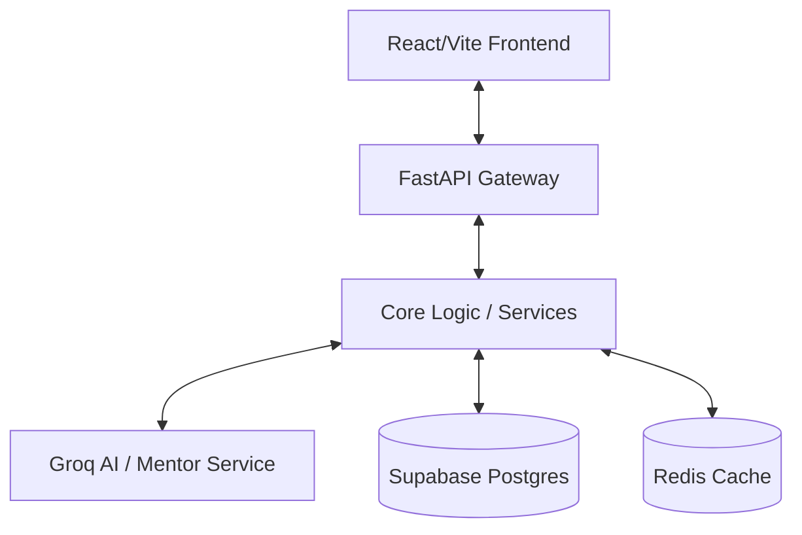

# AILA: Scholarly AI Workspace Architecture

The Scholarly AI Workspace (AILA) is built as a high-performance, intelligent learning platform that leverages a Layered Architecture and AI-driven insights to create a premium educational experience.

## System Overview

## Backend (FastAPI)
The backend is structured into several key layers:
- **API Layer**: Handles routing, validation, and HTTP responses.
- **Service Layer**: Contains the core business logic (Intelligence scoring, Tip generation).
- **Core Layer**: Shared configuration, security, and dependencies.
- **Models**: SQLAlchemy database models.

## Frontend (React + Vite)
- **Store**: Uses `zustand` for predictable state management (Intelligence tracking, Session history).
- **Components**: Modular UI components styled with vanilla CSS for maximum design flexibility.
- **Shell**: A premium, tri-column layout with scholarly aesthetics.

## AI & Intelligence Engine
- **Intelligence Score**: A weighted algorithm (40% coverage, 30% quiz results, 30% accuracy) that tracks real-time progress.
- **Mentor Tips**: Dynamic study advice generated via LLM (Groq/Llama-3) based on recent user activity.

## Deployment
Deployed as a monorepo on Vercel:
- Frontend: Static asset hosting.
- Backend: Vercel Serverless Functions.
